# Backend-Project-210114
"Many to many" database relationships using Primary and Foreign Keys.

The goal for this project was to create the initial backend of a capstone full stack project for a generic international NGO. We selected Asia and designated the NGO as Asian Non-Governmental Organization (ANGO). The frontend was divided into two parts, i.e., a public web area and a private, members only web area.

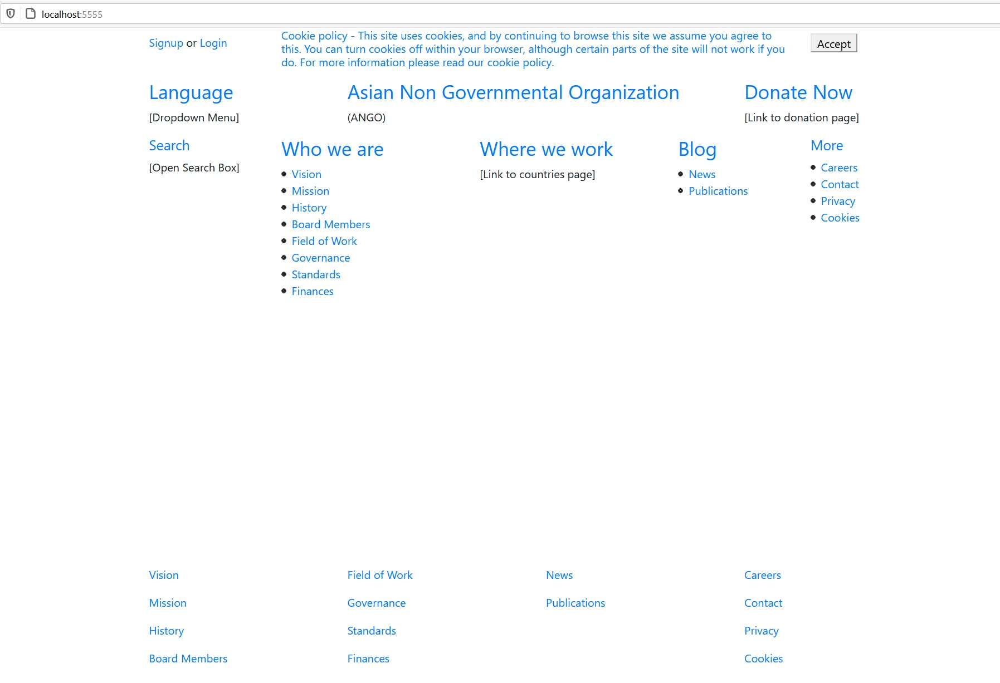

The public home page has links to various pages explaining the who, what, and where about the NGO. There is a cookies banner that displays on each page until the user clicks the accept button and then the banner is hidden as long as the cookies are not cleared. There is a donation link that takes the user to a donation page. The language drop down menu allows the user to choose in what language they want the web pages to be displayed.

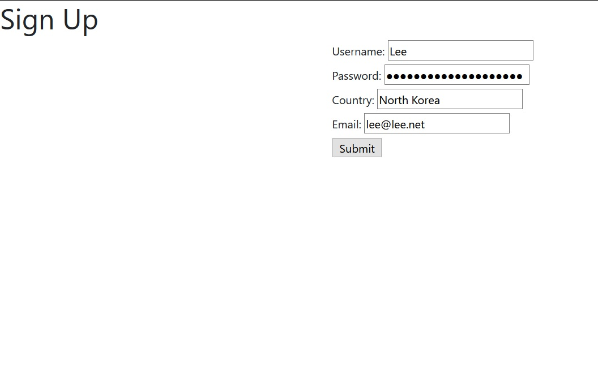

In order to access the private, members only area, the user must set up an account by clicking the "Signup" link that takes him to a form. The signup form has the user input his username, password, email, and country.

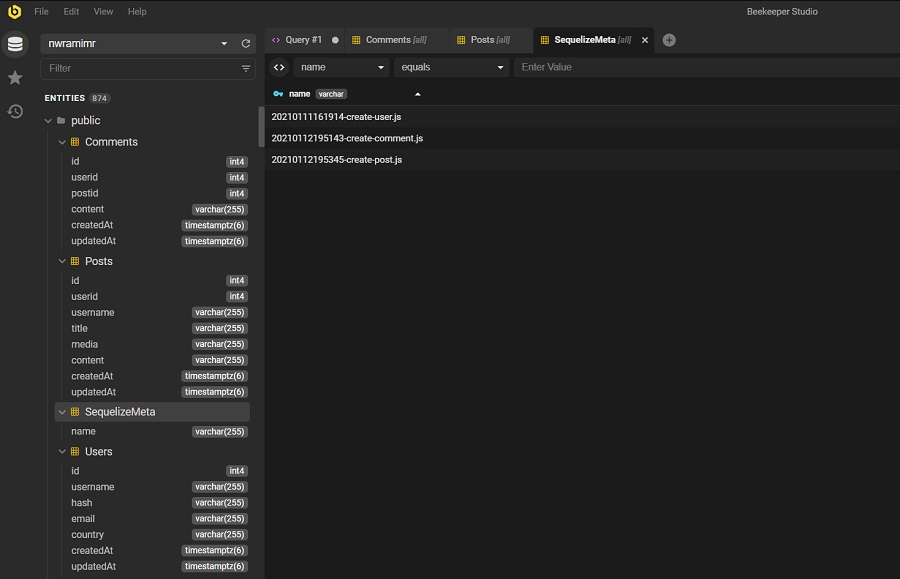

This information is saved in a sequelized data base.

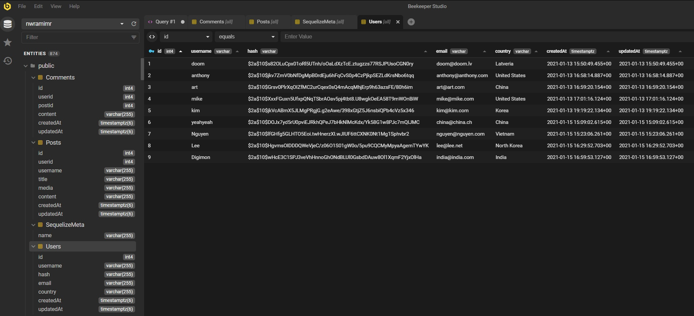

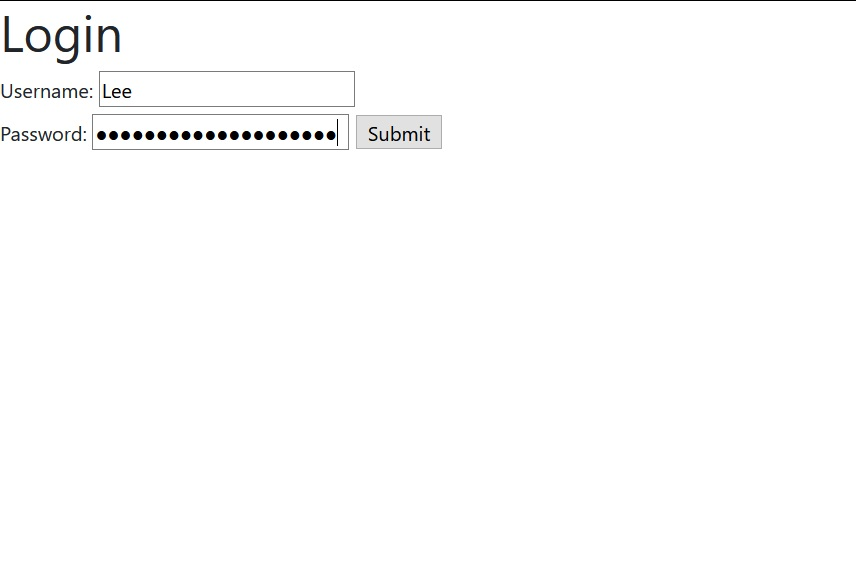

When the user clicks the submit button, he is taken to the Login form that let's him enter his username and password.

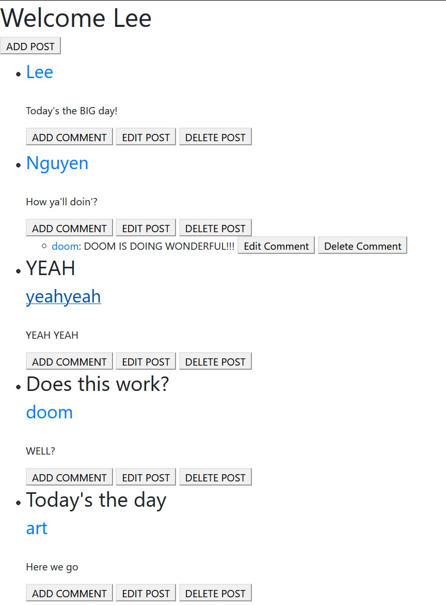

Clicking the submit button takes him (for purposes of this backend project) immediately to the members only chat feature which welcomes the user by his login username. 

The chat feature allows the user to make posts and comments, edit those posts and comments, and delete the posts and comments. This information is saved in a sequelized database according to the user's primary key.

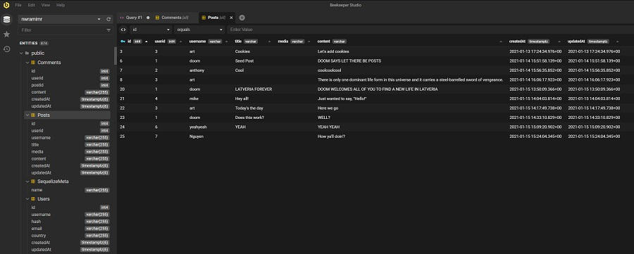

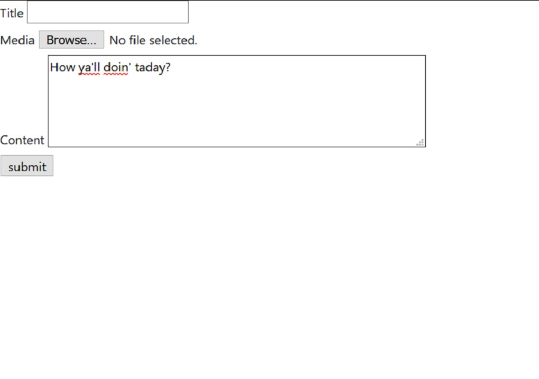

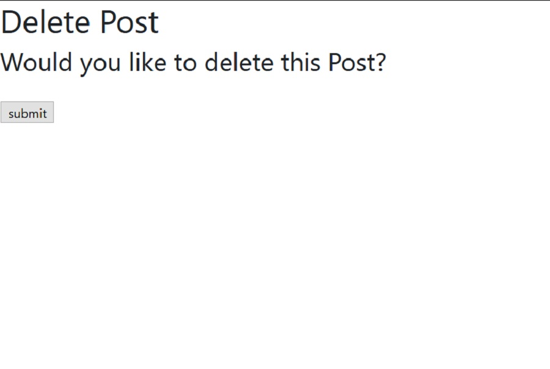

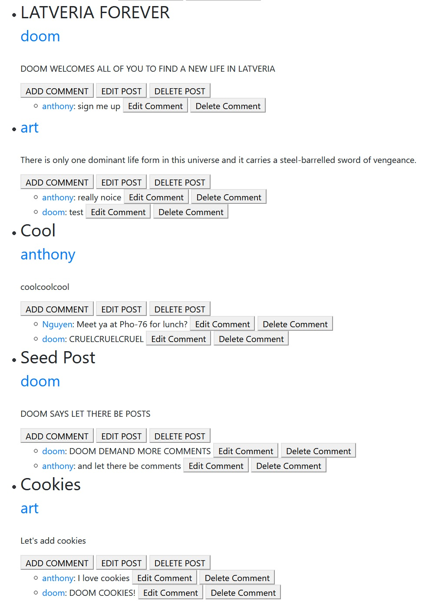

The logged in user can also see posts and comments made by other users and can comment on those other users' posts and comments.

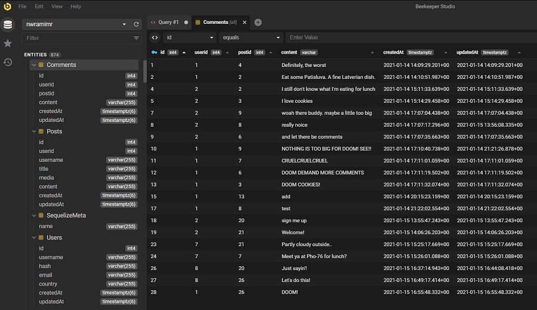

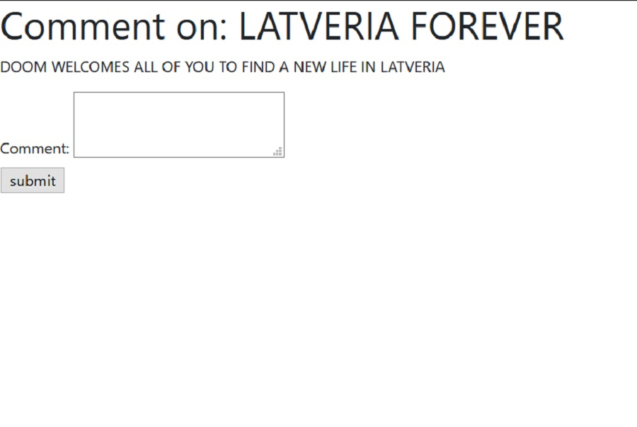

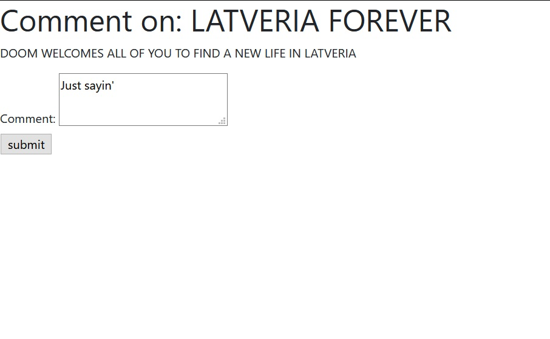

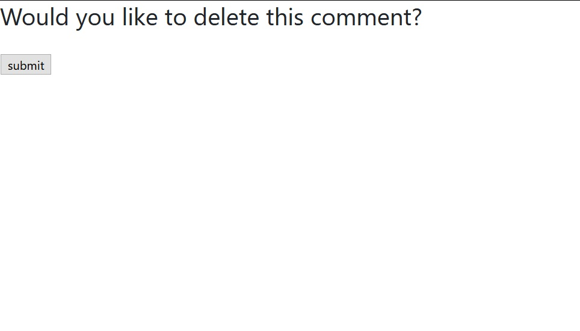

The logged in user can only edit and delete their own primary key posts and comments. If the logged in user tries to edit or delete another user's foreign key posts or comments, when he clicks submit, he is just routed back to the chat page and can see that his actions had no effect on the post or comment he tried to edit or delete.
